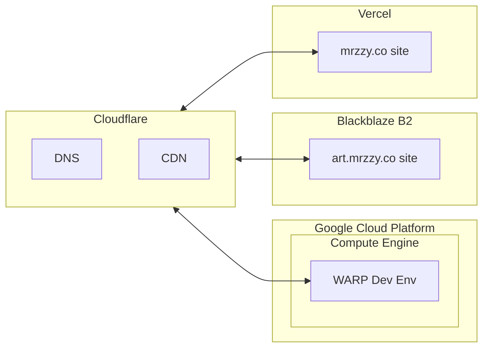

# Nimbus

Self-hosted services in the Cloud.

## Introduction

Nimbus centralises Infrastructure (eg. Terraform deployments, Docker Containers) that deploys self-hosted services on Cloud Platforms in one repository.

## Features

- **Infrastructure as Code (IaC)** Expressing IaC makes infrastructure dynamic & malleable to changes. Dependencies between Multiple Cloud providers can be expressed explicitly in code. Checking IaC into Git provides checkpoints for rollbacks if something goes wrong.
- **Multi Cloud** Consolidates deployments on multiple Cloud Platforms (GCP, Cloudflare &amp; Blackblaze) in one place.

## Architecture

## Services

User-facing services hosted on Nimbus:

- [WARP](https://github.com/mrzzy/warp): portable development environment based on Cloud VM.
- [mrzzy.co](https://mrzzy.co): Coding Portfolio website hosted on Vercel.
- [art.mrzzy.co](https://art.mrzzy.co): Art website hosted on Blackblaze B2.

## License

MIT.
