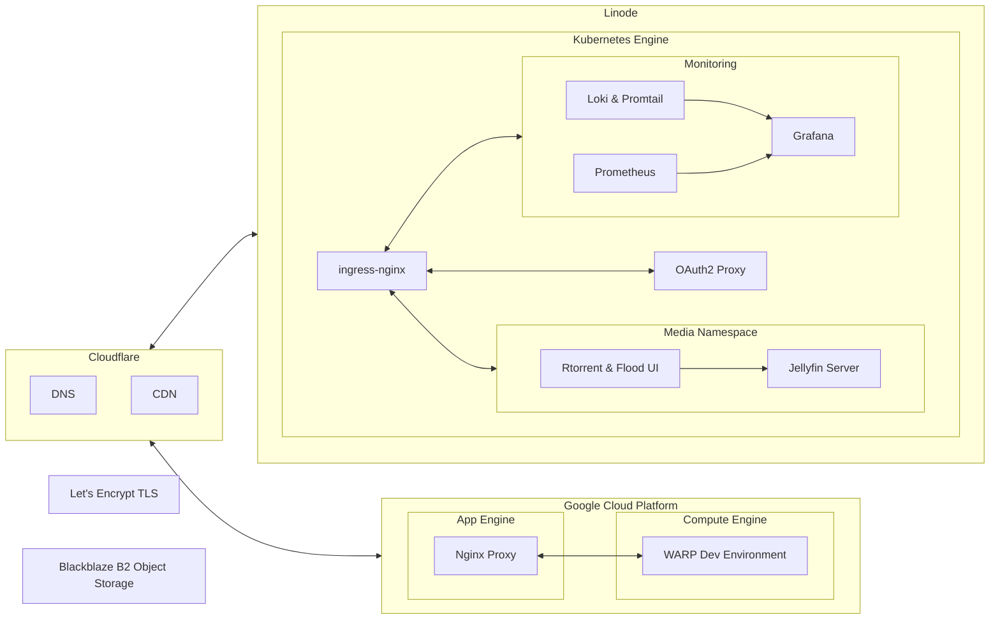

# Nimbus
Self-hosted services in the Cloud.

## Introduction
Nimbus centralises Infrastructure (eg. Terraform deployments, Kubernetes Manifests & Docker Containers) that deploys self-hosted services on multiple Cloud Platforms in one repository.

## Features
- **Multi-Cloud Management** Nimbus simplifies management of Infrastructure hosted on multiple Cloud Platforms (ie. Google Cloud Platform (GCP), Linode, Cloudflare) by deploying them from one place.
- **Economies of Scale**  Cross-cutting concerns between Self-hosted services (eg. Logging, Monitoring, CDN Caching & DNS) can be fulfilled via a set of shared services that only need to be deployed once.
- **Infrastructure as Code (IaC)** Expressing IaC makes infrastructure dynamic & malleable to changes. Dependencies between Multiple Cloud providers can be expressed explicitly in code. Checking IaC into Git provides checkpoints for rollbacks if something goes wrong.

## Architecture

## Services
User-facing services hosted on Nimbus:
- [WARP](https://github.com/mrzzy/warp): portable development environment based on Cloud VM
- [Jellyfin](https://jellyfin.org/): media server for personal media consumption.

## License
MIT.
